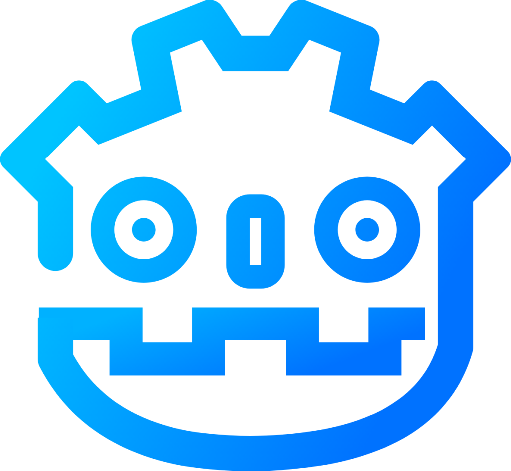

# CURSO DE GDSCRIPT
👨‍⚖️GDSCRIPT É UMA LINGUAGEM DE PROGRAMAÇÃO.

  

## VISÃO PANORÂMICA:
| PERGUNTA | RESPOSTA |
| :---: | :---: |
| DATA DE CRIAÇÃO | 2014 |
| NOME DO CRIADOR | Juan Linietsky e Ariel Manzur | 
| SIGNIFICADO DO NOME | O nome "GDScript" refere-se ao Godot Engine, sugerindo uma linguagem de script integrada para facilitar o desenvolvimento de jogos no motor Godot. |
| É BASEADA NO | Python |
| EXTENSÃO DO ARQUIVO | .gd |
| É MAIS USADA | No desenvolvimento de jogos usando o Godot Engine. |

A GDScript é uma linguagem de programação criada especificamente para o Godot Engine. Aqui estão algumas informações adicionais:

- **Data de Criação:** A GDScript foi introduzida em 2014, juntamente com o lançamento do Godot Engine 1.0.

- **Nome do Criador:** Juan Linietsky e Ariel Manzur são os principais desenvolvedores do Godot Engine e criadores do GDScript.

- **Significado do Nome:** O nome "GDScript" vem do Godot Engine, indicando uma linguagem de script nativa projetada para facilitar o desenvolvimento dentro deste ambiente.

- **Baseada em:** GDScript é inspirado em Python, compartilhando uma sintaxe semelhante para facilitar a aprendizagem e uso.

- **Extensão do Arquivo:** Os arquivos de script em GDScript usam a extensão `.gd`.

- **Usos Comuns:** GDScript é usado principalmente para o desenvolvimento de jogos e aplicações interativas dentro do Godot Engine. É uma linguagem projetada para ser eficiente e fácil de usar, permitindo que desenvolvedores adicionem lógica e funcionalidade aos seus jogos de forma rápida e intuitiva. GDScript é popular entre desenvolvedores indie e profissionais devido à sua integração profunda com o Godot Engine e a curva de aprendizado amigável.

## SUA HISTÓRIA:
GDScript é uma linguagem de programação dedicada ao Godot Engine, um motor de jogos open-source. Foi introduzida em 2014 pelos criadores do Godot, Juan Linietsky e Ariel Manzur, com o lançamento da versão 1.0 do motor. A linguagem foi projetada para ser simples e intuitiva, oferecendo aos desenvolvedores uma ferramenta poderosa e fácil de usar para criar jogos e aplicativos interativos. Inspirada pela sintaxe do Python, GDScript visa oferecer uma curva de aprendizado suave, permitindo que desenvolvedores, tanto iniciantes quanto experientes, possam rapidamente prototipar e desenvolver seus projetos. Desde seu lançamento, GDScript evoluiu juntamente com o Godot Engine, recebendo melhorias contínuas e novas funcionalidades para atender às necessidades da comunidade de desenvolvedores.

## CARACTERÍSTICAS:
### POSITIVAS:
1. **Sintaxe Simples e Intuitiva:** Inspirada em Python, a sintaxe de GDScript é fácil de aprender e usar, facilitando o desenvolvimento rápido de jogos.
2. **Integração Profunda com Godot Engine:** GDScript é nativamente integrado ao Godot, permitindo acesso direto a todos os recursos do motor sem a necessidade de bibliotecas externas.
3. **Tipagem Dinâmica e Estática:** Suporta tipagem dinâmica e estática, permitindo flexibilidade no desenvolvimento e ajudando a prevenir erros comuns.
4. **Alta Performance:** Embora seja uma linguagem de script, GDScript é altamente otimizada para desempenho no Godot Engine.
5. **Ferramentas de Depuração Avançadas:** Oferece ferramentas de depuração integradas que facilitam a identificação e correção de erros.
6. **Documentação e Comunidade Ativa:** A documentação oficial é extensa e a comunidade ao redor do Godot e GDScript é ativa e prestativa, oferecendo suporte e compartilhando conhecimento.

### NEGATIVAS:
1. **Menor Performance Comparada a C++:** Embora otimizada, GDScript não oferece o mesmo nível de desempenho que linguagens compiladas como C++.
2. **Menor Flexibilidade Fora do Godot:** GDScript é específico para o Godot Engine, limitando seu uso fora deste ambiente.
3. **Curva de Aprendizado para Recursos Avançados:** Embora a sintaxe básica seja fácil, recursos mais avançados podem exigir um entendimento mais profundo do Godot Engine.
4. **Atualizações e Mudanças:** Como o Godot Engine e GDScript estão em desenvolvimento ativo, mudanças e atualizações frequentes podem introduzir incompatibilidades ou exigir adaptação do código.
5. **Menor Suporte de Ferramentas Externas:** Comparado a outras linguagens mais estabelecidas, GDScript tem menos ferramentas de desenvolvimento e bibliotecas externas disponíveis.

# SUBSIDIOS:
- [CURSO CRIADO PELO VILHALVA](https://github.com/VILHALVA)
- [VEJA A DOCUMENTAÇÃO](https://docs.godotengine.org/pt-br/4.x/tutorials/scripting/gdscript/index.html)
- [USADO NA ENGINE](https://github.com/VILHALVA/CURSO-DE-GODOT)
- [VEJA A SINTAXE](./SINTAXE.md)
- [VEJA O MANUAL](./MANUAL.md)
- [VEJA OS PROJETOS](https://github.com/VILHALVA?tab=repositories&q=topic:GDSCRIPT)

